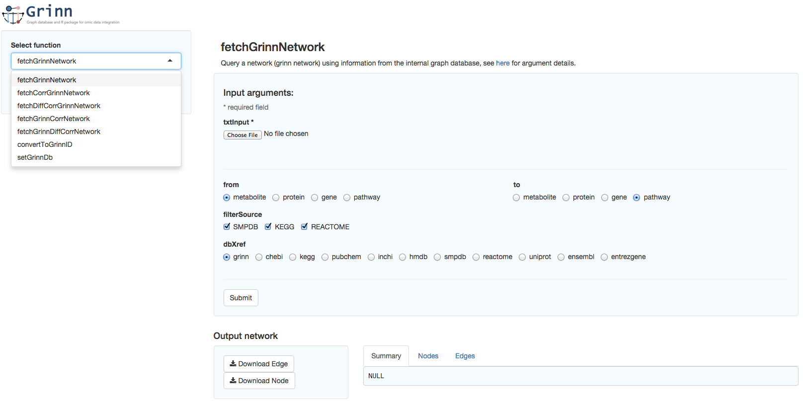

# grinnGUI
Graphical user interface for Grinn

Version: 1.2 (25 January 2016)

Description
=========
grinnGUI is the graphical user interface for the R-based tool [Grinn](https://github.com/kwanjeeraw/grinn).
The user interface is implemented using [Shiny](http://shiny.rstudio.com/) and runs on a web browser (Safari, Chrome, Firefox and etc.).


Install and Run
=========
* Require [shiny](http://shiny.rstudio.com/) and [grinn](https://github.com/kwanjeeraw/grinn). 
* Download grinnGUI .zip file and unzip 
* Run the following code

```
library(shiny)
runApp("[path to grinnGUI-master]/grinnGUI-master")
```

Documentation
=========
Outputs are exported as tab-delimited files.

list of support functions:
* convertToGrinnID
* fetchCorrGrinnNetwork
* fetchDiffCorrGrinnNetwork
* fetchGrinnCorrNetwork
* fetchGrinnDiffCorrNetwork
* fetchGrinnNetwork
* getGrinnDb
* setGrinnDb

see Grinn [homepage](http://kwanjeeraw.github.io/grinn/) for the function information.

Updates
=========
#### version 1.2 (25/01/16)
* Update parameter names in correspondence with the R functions
* Add a function setGrinnDb

#### version 1.1 (17/08/15)
* Provide delimiter options

#### version 1.0 (08/07/15)
* Initial version

License
=========
[GNU General Public License (v3)](https://github.com/kwanjeeraw/grinnGUI/blob/master/LICENSE)

